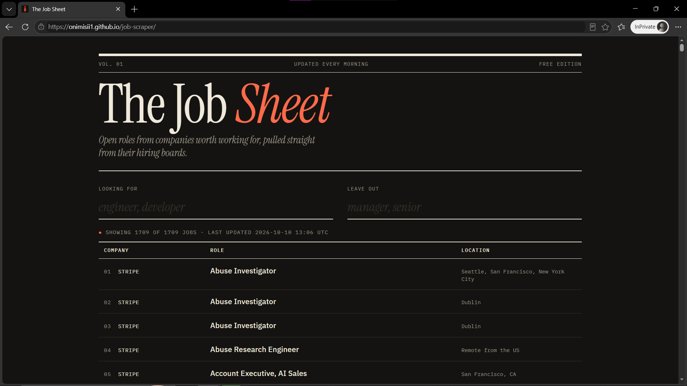

# The Job Sheet

**Live site → https://onimisii1.github.io/job-scraper/**

A job board that collects open roles from tech companies' public hiring boards every morning and lets you search them instantly in the browser.

## What it does

- Pulls live listings from company job boards (Stripe, Coinbase, Airbnb, Discord, Figma, Dropbox, Reddit, GitLab) through the Greenhouse API
- Refreshes automatically every day with GitHub Actions; no server needed
- Search with include / exclude keywords, filtered live as you type
- Responsive layout: a table on desktop, classified-ad cards on phones, and an automatic dark mode

## How it works

GitHub Actions (daily, 06:00 UTC)
  → build.py scrapes every company in config.py
  → saves docs/jobs.json and commits it
GitHub Pages serves docs/
  → index.html loads jobs.json
  → JavaScript filters and renders the listings in the browser

Scraping is separate from serving: the scraper runs once a day in the background, so the site itself is a fast static page that never waits on outside APIs.

## Tech

- **Python**: scraping (`requests`), retries with backoff, error handling for bad company names and network failures
- **JavaScript**: fetching JSON, live keyword filtering, rendering the listings
- **HTML/CSS**: custom editorial design, CSS variables, responsive media queries, dark mode
- **GitHub Actions**: scheduled daily data pipeline
- **GitHub Pages**: static hosting

## Project structure

    scraper/
      sources.py      fetch jobs from the Greenhouse API (with retries)
      filters.py      keyword matching
      storage.py      CSV export
    config.py         companies and default keywords
    build.py          scrape everything → docs/jobs.json
    main.py           command-line version → jobs.csv
    docs/             the website (index.html, style.css, jobs.json)
    .github/workflows/update-jobs.yml

## Run it locally

    python -m venv .venv
    .venv\Scripts\activate          # Windows
    pip install -r requirements.txt
    python build.py
    python -m http.server 8000 --directory docs

Then open http://localhost:8000.

## Add a company

Find the company's Greenhouse board name in its job links
(`boards.greenhouse.io/<name>`) and add it to `COMPANIES` in `config.py`.

## What I'd build next

- More sources (Lever, Ashby) behind the same interface
- A database of past runs to show new listings and job-posting trends
- Email alerts for saved searches